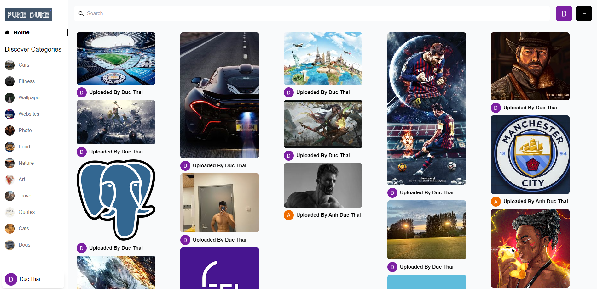
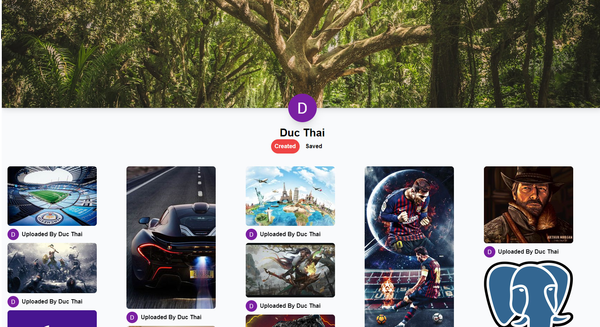
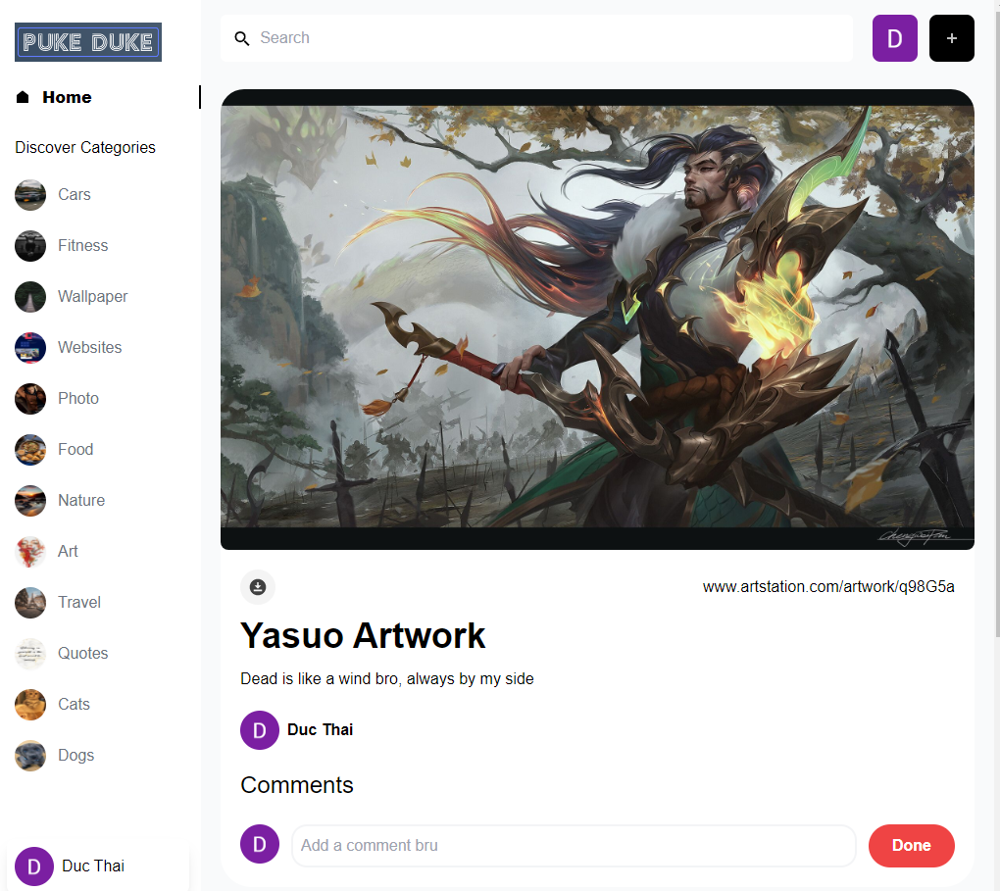

## Pinterest Clone - Puke Duke Version

* Images sharing application with UI/UX inspired by Pinterest
* Database: Sanity 
* Tech Stack: React JS + Vite + Sanity Query Language
* Google Authentication and Authorization 
* Like and Comment On Picture/Pin
* Vist Other User Profiles and explore their interests



## First, run the development server:

```bash
npm run dev
# or
yarn dev
```




Open [http://localhost:5173](http://localhost:5173) with your browser to see the result.




## Deploy on Netlify


Check out the live application  [Pinterest Clone - PukeDuke Version](https://playful-pudding-ba904e.netlify.app/) for more details.
